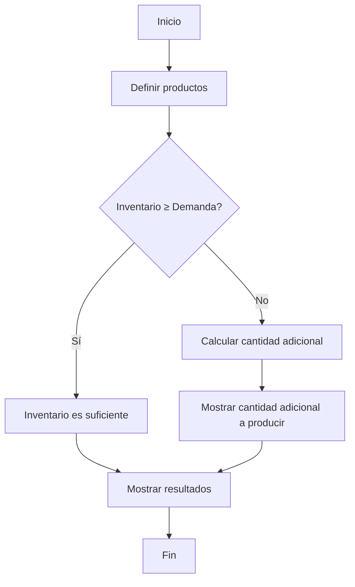
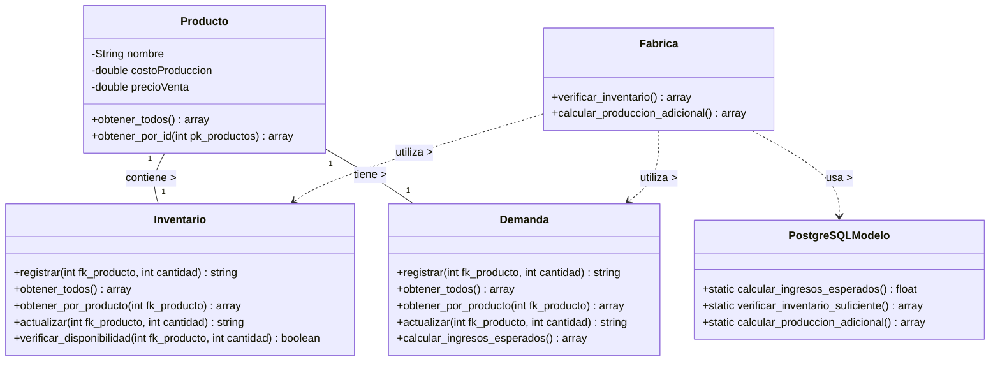

# Especificaciones Técnicas del Sistema MVC

> [!IMPORTANT] > **NOTA EDUCATIVA Y DE LICENCIA**  
> Este documento y el proyecto asociado son de naturaleza educativa, desarrollados en un contexto académico.
>
> - La arquitectura MVC implementada está adaptada para fines didácticos y puede no reflejar todas las mejores prácticas de una implementación profesional completa.
> - Este material está diseñado principalmente para estudiantes que están aprendiendo los fundamentos de programación web, bases de datos y patrones de diseño.
> - Todo el código y documentación se consideran de código abierto y pueden utilizarse, modificarse y distribuirse libremente con propósitos educativos.
> - Se recomienda no utilizar esta implementación directamente en entornos de producción sin realizar las adaptaciones necesarias para cumplir con estándares industriales de seguridad y eficiencia.

Este documento establece las especificaciones técnicas, estándares y guías para el desarrollo de aplicaciones PHP basadas en el patrón de arquitectura MVC. Sirve como referencia para mantener la consistencia y calidad en el desarrollo de proyectos actuales y futuros.

## Índice

1. [Estructura MVC](#estructura-mvc)
2. [Especificaciones de Base de Datos](#especificaciones-de-base-de-datos)
3. [Estándares de Codificación](#estándares-de-codificación)
4. [Documentación Técnica](#documentación-técnica)
5. [Gestión de Dependencias](#gestión-de-dependencias)
6. [Seguridad](#seguridad)
7. [Optimización](#optimización)
8. [Flujo de Trabajo](#flujo-de-trabajo)
9. [Estándares para Diagramas](#estándares-para-diagramas)

## Estructura MVC

### Organización de Carpetas

```
/
├── app/
│   ├── controllers/         # Controladores de la aplicación
│   ├── models/              # Modelos para interactuar con la base de datos
│   │   └── sql/             # Scripts SQL para la creación de esquemas y funciones
│   └── views/               # Vistas para presentar la información
│       ├── components/      # Componentes reutilizables (menú, pie de página)
│       └── modules/         # Módulos de la aplicación (páginas principales)
├── assets/                  # Recursos estáticos
│   ├── css/                 # Hojas de estilo
│   ├── js/                  # Scripts de cliente
│   └── img/                 # Imágenes
├── config/                  # Configuraciones de la aplicación
├── vendor/                  # Dependencias gestionadas por Composer
├── .env                     # Variables de entorno (no se incluye en repositorio)
├── .env.example             # Plantilla para variables de entorno
├── .gitignore               # Archivos a ignorar en control de versiones
├── composer.json            # Definición de dependencias
├── index.php                # Punto de entrada principal
└── README.md                # Documentación del proyecto
```

### Responsabilidades

#### Modelos

- **Función**: Gestionar la conexión y operaciones con la base de datos
- **Responsabilidades**:
  - Implementar métodos CRUD (Crear, Leer, Actualizar, Eliminar)
  - Aplicar validaciones de datos
  - Encapsular la lógica de negocio relacionada con los datos
  - Optimizar consultas SQL
  - Implementar transacciones para operaciones complejas

#### Controladores

- **Función**: Coordinar las interacciones entre modelo y vista
- **Responsabilidades**:
  - Procesar las solicitudes del usuario
  - Validar datos de entrada
  - Llamar a los métodos apropiados del modelo
  - Preparar los datos para las vistas
  - Gestionar redirecciones y mensajes de estado

#### Vistas

- **Función**: Presentar la información al usuario
- **Responsabilidades**:
  - Mostrar los datos proporcionados por el controlador
  - Implementar formularios para la entrada de datos
  - Mantener una interfaz de usuario consistente
  - Separar la lógica de presentación de la lógica de negocio

## Especificaciones de Base de Datos

### Normalización

Todas las bases de datos deben estar normalizadas hasta la Tercera Forma Normal (3FN):

1. **Primera Forma Normal (1FN)**:

   - Eliminar grupos repetitivos en tablas individuales
   - Crear una tabla separada para cada conjunto de datos relacionados
   - Identificar cada conjunto de datos relacionados con una clave primaria

2. **Segunda Forma Normal (2FN)**:

   - Cumplir con todos los requisitos de la Primera Forma Normal
   - Eliminar subconjuntos de datos que se aplican a múltiples filas de una tabla
   - Crear tablas separadas para estos subconjuntos de datos
   - Relacionar estas tablas con una clave foránea

3. **Tercera Forma Normal (3FN)**:
   - Cumplir con todos los requisitos de la Segunda Forma Normal
   - Eliminar campos que no dependan de la clave primaria
   - Mover estos campos a tablas apropiadas donde dependan de la clave primaria

### Campos Obligatorios

Cada tabla debe incluir los siguientes campos:

| Campo    | Tipo     | Descripción                                | Restricción        |
| -------- | -------- | ------------------------------------------ | ------------------ |
| `hora`   | TIME     | Hora en que se almacena el registro        | NOT NULL           |
| `fecha`  | DATE     | Fecha en que se almacena el registro       | NOT NULL           |
| `estado` | SMALLINT | Estado del registro (1=activo, 0=inactivo) | NOT NULL DEFAULT 1 |

### Convenciones de Nombrado

| Elemento         | Convención                                                | Ejemplo                         |
| ---------------- | --------------------------------------------------------- | ------------------------------- |
| Tablas           | Sustantivo en singular                                    | `producto`, `inventario`        |
| Llaves primarias | Prefijo `pk_` seguido del nombre de la tabla              | `pk_productos`                  |
| Llaves foráneas  | Prefijo `fk_` seguido del nombre de la tabla referenciada | `fk_producto`                   |
| Índices          | Prefijo `idx_` seguido de las columnas indexadas          | `idx_producto_nombre`           |
| Campos booleanos | Prefijo `es_` o `tiene_`                                  | `es_activo`, `tiene_stock`      |
| Campos de estado | `estado` con valores numéricos                            | `estado` (1=activo, 0=inactivo) |
| Marcas de tiempo | `fecha_creacion`, `fecha_actualizacion`                   | Ídem                            |

### Restricciones de Nulidad

- Las llaves primarias siempre deben ser NOT NULL
- Las llaves foráneas no deben permitir valores nulos, salvo justificación específica
- Los campos específicos del negocio deben evaluarse individualmente para determinar si pueden ser nulos

### Relación Entre Tablas

- Toda relación entre tablas debe implementarse mediante llaves foráneas
- Debe especificarse la acción a realizar en caso de eliminación o actualización (ON DELETE, ON UPDATE)
- Las relaciones pueden ser:
  - Uno a uno (1:1)
  - Uno a muchos (1:N)
  - Muchos a muchos (N:M), implementada mediante una tabla intermedia

### Tipos de Datos Recomendados

| Tipo de Dato       | Uso Recomendado               | PostgreSQL          |
| ------------------ | ----------------------------- | ------------------- |
| Enteros            | Identificadores, contadores   | `INTEGER`, `SERIAL` |
| Texto corto        | Nombres, descripciones breves | `VARCHAR(100)`      |
| Texto largo        | Descripciones extensas        | `TEXT`              |
| Fechas             | Fechas sin horario            | `DATE`              |
| Fecha y hora       | Marcas de tiempo              | `TIMESTAMP`         |
| Valores monetarios | Precios, costos               | `DECIMAL(10,2)`     |
| Booleanos          | Estados binarios              | `BOOLEAN`           |

### Ejemplo de Creación de Tabla

```sql
-- Tabla de productos
CREATE TABLE productos (
    pk_productos SERIAL PRIMARY KEY NOT NULL,
    nombre VARCHAR(100) NOT NULL,
    costo_produccion DECIMAL(10,2) NOT NULL,
    precio_venta DECIMAL(10,2) NOT NULL,
    hora TIME NOT NULL DEFAULT CURRENT_TIME,
    fecha DATE NOT NULL DEFAULT CURRENT_DATE,
    estado SMALLINT NOT NULL DEFAULT 1
);

-- Tabla de inventario
CREATE TABLE inventario (
    pk_inventario SERIAL PRIMARY KEY NOT NULL,
    fk_producto INTEGER NOT NULL,
    cantidad INTEGER NOT NULL DEFAULT 0,
    hora TIME NOT NULL DEFAULT CURRENT_TIME,
    fecha DATE NOT NULL DEFAULT CURRENT_DATE,
    estado SMALLINT NOT NULL DEFAULT 1,
    FOREIGN KEY (fk_producto) REFERENCES productos(pk_productos) ON DELETE RESTRICT
);
```

### Optimización para PostgreSQL

#### Funciones PL/pgSQL

Las funciones en PostgreSQL deben seguir estas directrices:

1. **Nomenclatura**:

   - Los nombres deben ser descriptivos y utilizar snake_case
   - Utilizar verbos que indiquen la acción que realiza la función

2. **Estructura**:

   - Incluir comentarios que expliquen el propósito de la función
   - Documentar los parámetros y valores de retorno
   - Utilizar bloques BEGIN/END para agrupar código
   - Implementar manejo de errores con bloques EXCEPTION

3. **Valores de Retorno**:

   - Para conjuntos de resultados, usar RETURNS TABLE
   - Para valores escalares, especificar el tipo de dato adecuado
   - Utilizar SETOF para conjuntos de filas de una tabla existente

4. **Parámetros**:

   - Nombrar los parámetros con un prefijo p\_ para distinguirlos de las columnas
   - Especificar el modo del parámetro (IN, OUT, INOUT) cuando sea necesario

5. **Transacciones**:
   - Las funciones complejas deben manejar sus propias transacciones
   - Utilizar COMMIT y ROLLBACK explícitos cuando sea necesario

#### Ejemplo de Función PL/pgSQL

```sql
/**
 * Verifica si el inventario es suficiente para cubrir la demanda
 *
 * @return TABLE con los productos, su inventario, demanda y estado de suficiencia
 */
CREATE OR REPLACE FUNCTION verificar_inventario_suficiente()
RETURNS TABLE (
    producto_id INTEGER,
    nombre_producto VARCHAR,
    inventario_actual INTEGER,
    demanda_semanal INTEGER,
    es_suficiente BOOLEAN
) AS $$
BEGIN
    -- Devolver resultados calculados
    RETURN QUERY
    SELECT
        p.pk_productos,
        p.nombre,
        i.cantidad AS inventario_actual,
        d.cantidad AS demanda_semanal,
        CASE WHEN i.cantidad >= d.cantidad THEN TRUE ELSE FALSE END AS es_suficiente
    FROM productos p
    JOIN inventario i ON p.pk_productos = i.fk_producto
    JOIN demanda d ON p.pk_productos = d.fk_producto
    WHERE p.estado = 1 AND i.estado = 1 AND d.estado = 1
    ORDER BY p.nombre;

    -- Manejar casos donde no hay resultados
    IF NOT FOUND THEN
        RAISE NOTICE 'No se encontraron productos con inventario y demanda registrados';
    END IF;
END;
$$ LANGUAGE plpgsql;
```

```sql
/**
 * Registra la producción adicional necesaria para satisfacer la demanda
 *
 * @return TEXT mensaje de resultado de la operación
 */
CREATE OR REPLACE FUNCTION registrar_produccion_adicional()
RETURNS TEXT AS $$
DECLARE
    v_total_registros INTEGER := 0;
    v_reg RECORD;
    v_cantidad_adicional INTEGER;
BEGIN
    -- Iniciar transacción
    START TRANSACTION;

    -- Procesar cada producto con demanda mayor al inventario
    FOR v_reg IN
        SELECT
            p.pk_productos,
            p.nombre,
            d.cantidad - i.cantidad AS cantidad_adicional
        FROM productos p
        JOIN inventario i ON p.pk_productos = i.fk_producto
        JOIN demanda d ON p.pk_productos = d.fk_producto
        WHERE p.estado = 1 AND i.estado = 1 AND d.estado = 1
        AND d.cantidad > i.cantidad
    LOOP
        -- Insertar registro de producción adicional
        INSERT INTO produccion_adicional (
            fk_producto, cantidad, hora, fecha, estado
        ) VALUES (
            v_reg.pk_productos,
            v_reg.cantidad_adicional,
            CURRENT_TIME,
            CURRENT_DATE,
            1
        );

        v_total_registros := v_total_registros + 1;
    END LOOP;

    -- Finalizar transacción
    COMMIT;

    -- Devolver mensaje de resultado
    IF v_total_registros > 0 THEN
        RETURN 'Se registraron ' || v_total_registros || ' productos para producción adicional';
    ELSE
        RETURN 'No se requiere producción adicional';
    END IF;
EXCEPTION
    WHEN OTHERS THEN
        -- Revertir cambios en caso de error
        ROLLBACK;
        RETURN 'Error: ' || SQLERRM;
END;
$$ LANGUAGE plpgsql;
```

#### Índices

1. **Creación de Índices**:

   - Crear índices para las columnas frecuentemente usadas en cláusulas WHERE, JOIN y ORDER BY
   - Utilizar índices compuestos para consultas con múltiples condiciones
   - Seguir la convención de nomenclatura `idx_tabla_columna(s)`

2. **Tipos de Índices**:

   - B-Tree: Adecuado para la mayoría de casos (operadores =, <, >, <=, >=)
   - Hash: Optimizado para operaciones de igualdad (=)
   - GiST: Para datos geométricos y tipos personalizados
   - GIN: Para búsquedas en arrays y texto completo
   - BRIN: Para conjuntos de datos muy grandes con correlación física

3. **Mantenimiento**:
   - Revisar periódicamente el rendimiento con EXPLAIN ANALYZE
   - Ejecutar REINDEX cuando sea necesario
   - Considerar la reconstrucción de índices fragmentados

```sql
-- Índice para búsquedas por nombre de producto
CREATE INDEX idx_productos_nombre ON productos(nombre);

-- Índice compuesto para búsquedas filtradas por estado y ordenadas por fecha
CREATE INDEX idx_productos_estado_fecha ON productos(estado, fecha);

-- Índice para búsquedas por producto en inventario
CREATE INDEX idx_inventario_fk_producto ON inventario(fk_producto);
```

## Estándares de Codificación

### Nombrado de Variables y Funciones

| Elemento   | Convención       | Ejemplo                                    |
| ---------- | ---------------- | ------------------------------------------ |
| Clases     | CapitalCase      | `ProductoModelo`, `ControladorPrincipal`   |
| Métodos    | snake_case       | `obtener_todos()`, `registrar_producto()`  |
| Variables  | snake_case       | `$nombre_producto`, `$cantidad_disponible` |
| Constantes | UPPER_SNAKE_CASE | `ESTADO_ACTIVO`, `LIMITE_INVENTARIO`       |

### Estructura de Clases

- Todas las clases deben tener un propósito único y bien definido
- Seguir el principio de responsabilidad única
- Métodos estáticos para operaciones que no requieren estado

```php
class ProductoModelo
{
    // Propiedades privadas
    private $tabla = "productos";

    // Métodos públicos
    static public function obtener_todos()
    {
        // Implementación
    }

    static public function obtener_por_id($id)
    {
        // Implementación
    }
}
```

### Manejo de Errores

- Usar bloques try-catch para capturar excepciones
- Registrar errores en archivos de log mediante `error_log()`
- Mostrar mensajes de error amigables al usuario

```php
try {
    // Operación que puede fallar
    $resultado = $this->operacion_riesgosa();
    return $resultado;
} catch (Exception $e) {
    // Registrar el error
    error_log("Error en operación: " . $e->getMessage());

    // Devolver respuesta de error
    return "error";
}
```

## Documentación Técnica

### Estándar PHPDoc

- Todos los archivos, clases y métodos deben documentarse con PHPDoc
- La documentación debe ser clara, concisa y descriptiva

#### Documentación de Archivo

```php
<?php
/**
 * Nombre_archivo.php
 * Descripción breve del propósito del archivo
 *
 * Descripción detallada del archivo si es necesario.
 * Puede incluir múltiples líneas.
 */
```

#### Documentación de Clase

```php
/**
 * Clase para gestionar operaciones relacionadas con [entidad]
 *
 * Esta clase proporciona métodos para crear, leer, actualizar y eliminar
 * registros de [entidad] en la base de datos.
 */
class EntidadModelo
{
    // ...
}
```

#### Documentación de Método

```php
/**
 * Breve descripción de lo que hace el método
 *
 * Descripción detallada si es necesario, explicando la lógica
 * y el funcionamiento del método.
 *
 * @param tipo $parametro Descripción del parámetro
 * @return tipo Descripción del valor retornado
 * @throws TipoExcepcion Condiciones en las que se lanza la excepción
 */
public function metodo($parametro)
{
    // Implementación
}
```

### Ejemplo Completo

```php
<?php
/**
 * Inventario.modelo.php
 * Modelo para gestionar el inventario de productos
 *
 * Este archivo contiene la clase que maneja todas las operaciones
 * relacionadas con el inventario de productos en la base de datos.
 */

class InventarioModelo
{
    /**
     * Verifica si hay suficiente cantidad en inventario para un producto
     *
     * Compara la cantidad disponible en inventario con la cantidad
     * requerida para determinar si es suficiente.
     *
     * @param integer $fk_producto ID del producto a verificar
     * @param integer $cantidad_requerida Cantidad necesaria
     * @return boolean true si hay suficiente, false en caso contrario
     */
    static public function verificar_disponibilidad($fk_producto, $cantidad_requerida)
    {
        try {
            $stmt = Conexion::conectar()->prepare("
                SELECT cantidad
                FROM inventario
                WHERE fk_producto = :fk_producto AND estado = 1
            ");

            $stmt->bindParam(":fk_producto", $fk_producto, PDO::PARAM_INT);
            $stmt->execute();

            if($resultado = $stmt->fetch(PDO::FETCH_ASSOC)) {
                return $resultado["cantidad"] >= $cantidad_requerida;
            }

            return false;
        } catch (PDOException $e) {
            error_log("Error al verificar disponibilidad: " . $e->getMessage());
            return false;
        }
    }

    // Otros métodos...
}
```

## Gestión de Dependencias

### Variables de Entorno

- Usar .env para configuraciones sensibles o específicas del entorno
- Nunca incluir .env en el repositorio (usar .env.example como plantilla)
- Cargar variables de entorno al inicio de la aplicación

```php
// Cargar variables de entorno
$dotenv = Dotenv\Dotenv::createImmutable(__DIR__);
$dotenv->load();

// Uso
$host = $_ENV['DB_HOST'];
$dbname = $_ENV['DB_NAME'];
```

## Seguridad

### Principios Básicos

1. **Nunca confiar en los datos de entrada del usuario**

   - Validar y sanitizar todos los datos de entrada
   - Usar prepared statements para consultas SQL

2. **Proteger información sensible**

   - No almacenar contraseñas en texto plano
   - Usar variables de entorno para credenciales
   - No exponer información de errores al usuario final

3. **Validación de datos**
   - Implementar validación tanto en el cliente como en el servidor
   - Validar tipo, formato y rango de los datos

### Ejemplos de Prácticas

```php
// Preparar consulta (previene inyección SQL)
$stmt = $conexion->prepare("SELECT * FROM usuarios WHERE username = :username");
$stmt->bindParam(":username", $username, PDO::PARAM_STR);
$stmt->execute();

// Sanitizar salida (previene XSS)
echo htmlspecialchars($dato, ENT_QUOTES, 'UTF-8');
```

## Optimización

### Rendimiento de Base de Datos

- Usar índices adecuadamente
- Optimizar consultas con EXPLAIN ANALYZE
- Implementar paginación para grandes conjuntos de datos
- Usar transacciones para operaciones múltiples

### Carga Diferida

- Cargar solo los recursos necesarios para cada página
- Implementar carga bajo demanda para elementos no críticos

## Flujo de Trabajo

### Desarrollo de Nuevas Funcionalidades

1. **Análisis y Diseño**

   - Definir claramente los requisitos
   - Identificar modelos, vistas y controladores necesarios
   - Diseñar las tablas de base de datos requeridas

2. **Implementación**

   - Crear/modificar modelos
   - Implementar lógica de negocio
   - Desarrollar controladores
   - Diseñar vistas

3. **Pruebas**

   - Verificar funcionalidad
   - Validar seguridad
   - Comprobar integración con funcionalidades existentes

4. **Documentación**
   - Documentar código con PHPDoc
   - Actualizar documentación técnica
   - Actualizar README si es necesario

## Estándares para Diagramas

### Formato Mermaid

Todos los diagramas deben crearse utilizando el formato Mermaid, que permite:

- Mantener los diagramas como código
- Facilitar el versionado y la colaboración
- Generar visualizaciones consistentes

### Diagrama de Flujo

Los diagramas de flujo deben seguir estas convenciones:

1. **Elementos**:

   - Inicio/fin: Nodos con forma redondeada
   - Proceso: Nodos rectangulares
   - Decisión: Nodos en forma de diamante
   - Conector: Flechas direccionales

2. **Nomenclatura**:

   - Usar verbos activos para describir procesos
   - Frases cortas y claras
   - Formular preguntas para los nodos de decisión

3. **Ejemplo**:



### Diagrama UML de Clases

Los diagramas UML de clases deben seguir estas convenciones:

1. **Elementos**:

   - Clases: Rectángulos con nombre en la parte superior
   - Atributos: Listados debajo del nombre de la clase
   - Métodos: Listados debajo de los atributos
   - Relaciones: Líneas que conectan clases

2. **Nomenclatura**:

   - Nombres de clases en singular y CapitalCase
   - Atributos y métodos en camelCase o snake_case, según la convención del lenguaje
   - Indicar visibilidad con +, - o # (público, privado, protegido)

3. **Relaciones**:

   - Asociación: línea simple
   - Herencia: flecha con punta abierta
   - Implementación: flecha con punta abierta y línea punteada
   - Composición: línea con diamante negro
   - Agregación: línea con diamante blanco

4. **Ejemplo**:



Este anexo sirve como referencia para la solución implementada al problema específico de Gestión de Inventario y Demanda, pero los principios y patrones aplicados pueden extenderse a problemas similares en futuros problemas y/o proyectos.

---

## Aviso sobre Uso y Limitaciones

### Naturaleza Educativa del Proyecto

Este proyecto y sus especificaciones han sido desarrollados en un contexto educativo universitario. La arquitectura MVC implementada está simplificada para facilitar el aprendizaje y la comprensión de los conceptos fundamentales, por lo que puede diferir de implementaciones profesionales más robustas.

### Propósito

El propósito principal de este sistema es:

- Servir como herramienta de aprendizaje para estudiantes de desarrollo web
- Ilustrar la aplicación de patrones de diseño en un contexto práctico
- Demostrar la implementación de una base de datos relacional con PostgreSQL
- Proporcionar un ejemplo funcional de la interacción entre frontend y backend

### Limitaciones y Advertencias

Este proyecto tiene las siguientes limitaciones:

1. **Seguridad**: Las medidas de seguridad implementadas pueden no ser suficientes para un entorno de producción real.
2. **Escalabilidad**: La arquitectura puede requerir modificaciones para manejar aplicaciones de mayor escala.
3. **Rendimiento**: No se han realizado optimizaciones exhaustivas para maximizar el rendimiento.
4. **Compatibilidad**: Se ha probado en entornos específicos y puede requerir ajustes para otros contextos.

Se invita a los usuarios a extender, modificar y mejorar este código como parte de su proceso de aprendizaje, pero se recomienda precaución al implementarlo en entornos de producción sin realizar las modificaciones apropiadas.
