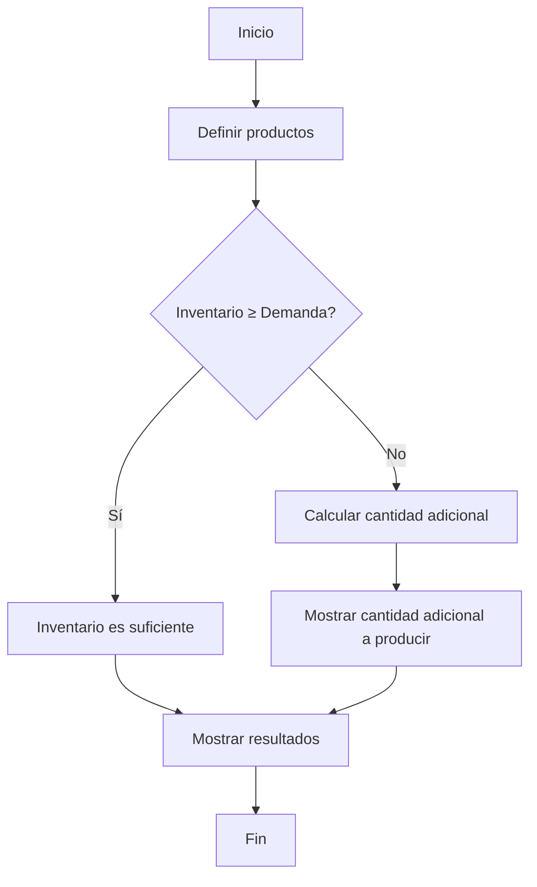
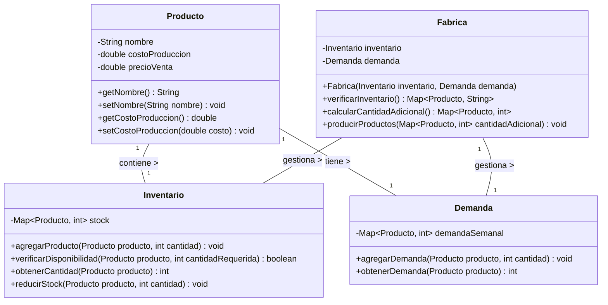

# Sistema de Gestión de Inventario y Demanda

Sistema desarrollado en PHP con arquitectura MVC para administrar el inventario, demanda y producción de productos en una fábrica.

<div align="center">
  
  
  
  
</div>

## Descripción

Este sistema da solución al **Problema 01: Gestión de Inventario y Demanda** que plantea lo siguiente:

> _Una fábrica produce tres tipos de productos con un inventario inicial. Cada producto tiene un costo de producción y una demanda semanal estimada._

### Requerimientos implementados

El sistema resuelve los siguientes requerimientos:

1. ✅ Calcular el total de ingresos esperados de la semana
2. ✅ Determinar si el inventario es suficiente para cubrir la demanda
3. ✅ Si no es suficiente, calcular la cantidad adicional que debe producirse para evitar pérdidas
4. ✅ Desarrollo del diagrama de flujo de la solución del problema
5. ✅ Desarrollo del diagrama UML de clases de la solución del problema
6. ✅ Generación del código SQL de la base de datos
7. ✅ Generación del código en PHP de la solución integral utilizando arquitectura MVC

## Funcionalidad

### Gestión de Inventario

Administra el stock disponible de cada producto:

```php
// Ejemplo de verificación de inventario utilizando MVC
$disponible = InventarioModelo::verificar_disponibilidad($id_producto, $cantidad);
$datos_inventario = InventarioModelo::obtener_por_producto($id_producto);
$respuesta = InventarioModelo::actualizar($id_producto, $nueva_cantidad);

// Desde el controlador
Controlador::actualizar_inventario_controlador();
Controlador::mostrar_inventario_controlador();
```

- Visualización de niveles de inventario
- Verificación de disponibilidad de productos

### Gestión de Demanda

Controla la demanda semanal estimada:

```php
// Ejemplo de gestión de demanda utilizando MVC
$respuesta = DemandaModelo::registrar($id_producto, $cantidad);
$cantidadDemandada = DemandaModelo::obtener_por_producto($id_producto);
$ingresos = DemandaModelo::calcular_ingresos_esperados($productos);

// Desde el controlador
Controlador::registrar_demanda_controlador();
Controlador::calcular_ingresos_esperados_controlador();
```

- Registro de la demanda semanal estimada por producto
- Cálculo de ingresos esperados basados en la demanda semanal

### Cálculos y Fabricación

```php
// Ejemplo de gestión de fábrica utilizando MVC
$estadoInventario = FabricaModelo::verificar_inventario($productos);
$produccionAdicional = FabricaModelo::calcular_produccion_adicional($productos, $inventario);

// Desde el controlador
Controlador::verificar_inventario_suficiente_controlador();
Controlador::calcular_produccion_adicional_controlador();
Controlador::mostrar_resultados_fabricacion_controlador();
```

- Cálculo de producción adicional necesaria cuando el inventario es insuficiente
- Gestión del proceso de producción adicional

## Modelo de Datos

El sistema implementa una base de datos con 4 tablas principales:

1. **productos**: Información de los tres tipos de productos fabricados

   ```sql
   CREATE TABLE productos (
       pk_productos INT PRIMARY KEY NOT NULL AUTO_INCREMENT,
       nombre VARCHAR(100) NOT NULL,
       costo_produccion DECIMAL(10,2) NOT NULL,
       precio_venta DECIMAL(10,2) NOT NULL
   );
   ```

2. **inventario**: Control del inventario inicial disponible
3. **demanda**: Registro de la demanda semanal estimada
4. **produccion_adicional**: Registro de las necesidades adicionales de producción

> **Note**
>
> La estructura completa de la base de datos se encuentra en el archivo `app/models/sql/tablas.sql`.

## Diagrama de Flujo

El siguiente diagrama de flujo representa la lógica de solución al problema:



## Diagrama UML de Clases

El sistema implementa las siguientes clases principales:



> **Warning**
>
> Este proyecto es una implementación educativa. Para un entorno de producción, se recomienda implementar medidas adicionales de seguridad y optimización.

## 🥷 Autor

<a href="https://github.com/hk4u-dxv">
  
</a>
