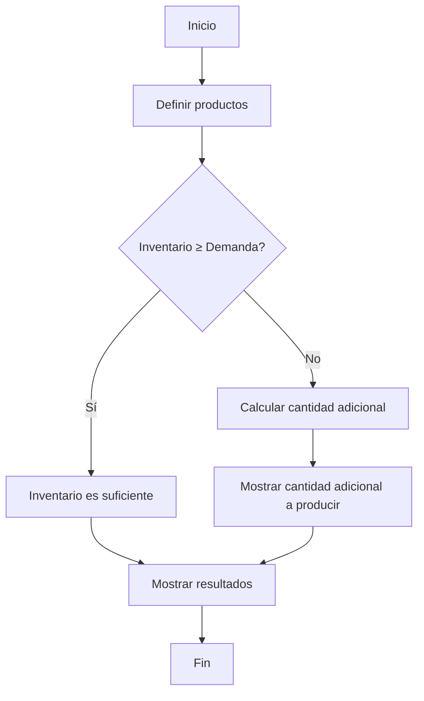
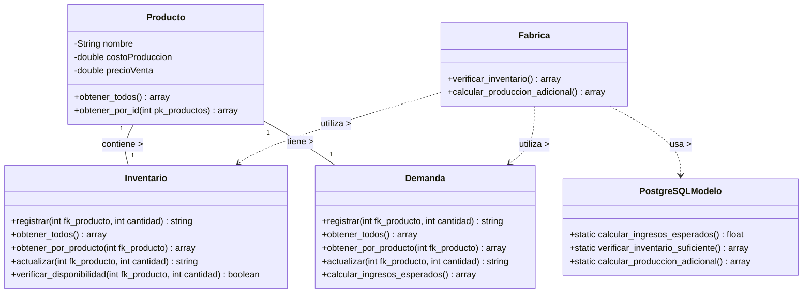

# Sistema de Gestión de Inventario y Demanda

Sistema desarrollado en PHP con arquitectura MVC para administrar el inventario, demanda y producción de productos en una fábrica. Optimizado para PostgreSQL.

<div align="center">
  
  
  
</div>

## Descripción

Este sistema da solución al **Problema 01: Gestión de Inventario y Demanda** que plantea lo siguiente:

> _Una fábrica produce tres tipos de productos con un inventario inicial. Cada producto tiene un costo de producción y una demanda semanal estimada._

### Requerimientos implementados

El sistema resuelve los siguientes requerimientos:

1. ✅ Calcular el total de ingresos esperados de la semana
2. ✅ Determinar si el inventario es suficiente para cubrir la demanda
3. ✅ Si no es suficiente, calcular la cantidad adicional que debe producirse para evitar pérdidas
4. ✅ Desarrollo del diagrama de flujo de la solución del problema
5. ✅ Desarrollo del diagrama UML de clases de la solución del problema
6. ✅ Generación del código SQL de la base de datos
7. ✅ Generación del código en PHP de la solución integral utilizando arquitectura MVC

## Funcionalidad

### Gestión de Demanda

Controla la demanda semanal estimada:

```php
// Ejemplo de gestión de demanda utilizando MVC
$respuesta = DemandaModelo::registrar($fk_producto, $cantidad);
$demanda = DemandaModelo::obtener_por_producto($fk_producto);
$ingresos = DemandaModelo::calcular_ingresos_esperados();

// Desde el controlador
Controlador::registrar_demanda_controlador();
Controlador::calcular_ingresos_esperados_controlador();
Controlador::mostrar_demanda_controlador();
```

- Registro de la demanda semanal estimada por producto
- Cálculo de ingresos esperados basados en la demanda semanal
- Visualización detallada de la demanda por producto

## Modelo de Datos

El sistema implementa una base de datos con 4 tablas principales:

1. **productos**: Información de los tres tipos de productos fabricados

   ```sql
   CREATE TABLE productos (
       pk_productos SERIAL PRIMARY KEY NOT NULL,
       nombre VARCHAR(100) NOT NULL,
       costo_produccion DECIMAL(10,2) NOT NULL,
       precio_venta DECIMAL(10,2) NOT NULL,
       hora TIME NOT NULL,
       fecha DATE NOT NULL,
       estado SMALLINT NOT NULL
   );
   ```

2. **inventario**: Control del inventario inicial disponible
3. **demanda**: Registro de la demanda semanal estimada
4. **produccion_adicional**: Registro de las necesidades adicionales de producción

> **Note**
>
> La estructura completa de la base de datos se encuentra en el archivo `app/models/sql/scheme_postgresql.sql`.

## Convenciones de Nomenclatura

Para mantener la consistencia y mejorar la legibilidad del código, se implementan las siguientes convenciones:

1. **Llaves primarias**: Todas las llaves primarias usan el prefijo `pk_` (ej. `pk_productos`, `pk_inventario`)
2. **Llaves foráneas**: Todas las llaves foráneas usan el prefijo `fk_` (ej. `fk_producto`)
3. **Consultas SQL**: Se utilizan consultas optimizadas para PostgreSQL

```php
// Ejemplo de convención de nomenclatura
$stmt = Conexion::conectar()->prepare("
    SELECT i.*, p.nombre as nombre_producto
    FROM inventario i
    JOIN productos p ON i.fk_producto = p.pk_productos
    WHERE i.estado = 1 AND p.estado = 1
");
```

## Optimizacion

### 1. Documentación Coherente

Se ha implementado documentación PHPDoc completa en todos los archivos:

```php
/**
 * Verifica si hay suficiente cantidad en inventario para un producto
 *
 * @param integer $fk_producto ID del producto
 * @param integer $cantidad_requerida Cantidad que se desea verificar
 * @return boolean true si hay cantidad suficiente, false en caso contrario
 */
static public function verificar_disponibilidad($fk_producto, $cantidad_requerida)
{
    // Implementación del método
}
```

### 2. Optimizacion para PostgreSQL

El sistema aprovecha características específicas de PostgreSQL:

1. **Funciones PL/pgSQL**: Para operaciones complejas como cálculos y verificaciones

   ```php
   // Uso de funciones optimizadas de PostgreSQL cuando están disponibles
   if (class_exists('PostgreSQLModelo')) {
       $resultados = PostgreSQLModelo::verificar_inventario_suficiente();
       // Formatear resultados para la vista
   }
   ```

2. **Transacciones optimizadas**: Gestión eficiente para operaciones que afectan múltiples tablas

## Diagrama de Flujo

El siguiente diagrama de flujo representa la lógica de solución al problema:



## Diagrama UML de Clases

El sistema implementa las siguientes clases principales:



> **Warning**
>
> Este proyecto es una implementación educativa. Para un entorno de producción, se recomienda implementar medidas adicionales de seguridad y optimización.

## 🥷 Autor

<a href="https://github.com/hk4u-dxv">
  
</a>
